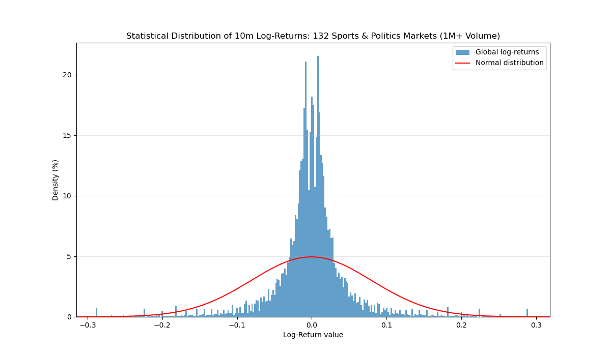
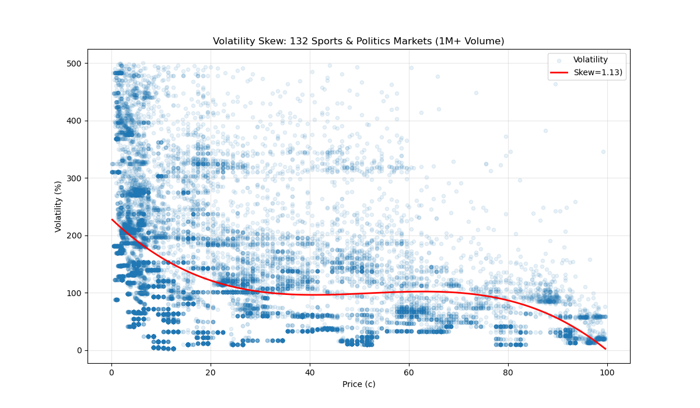
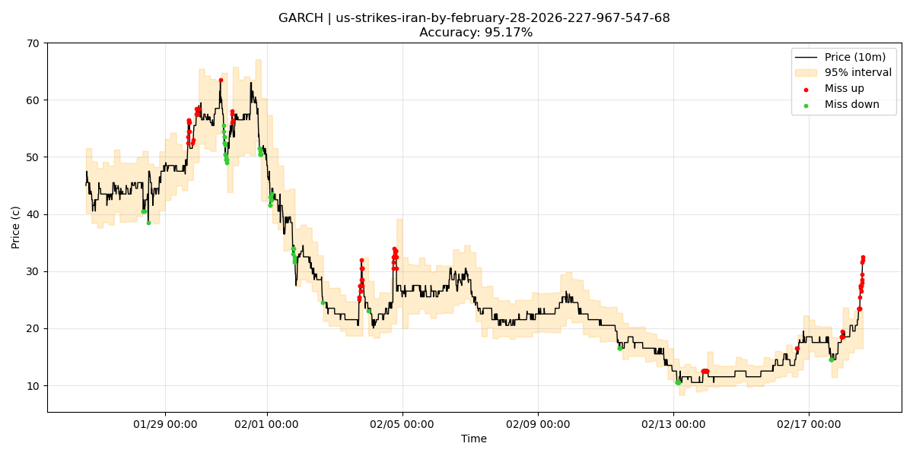
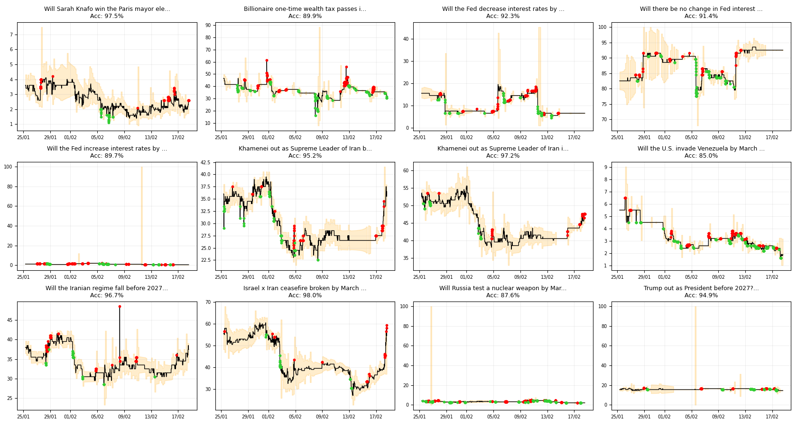
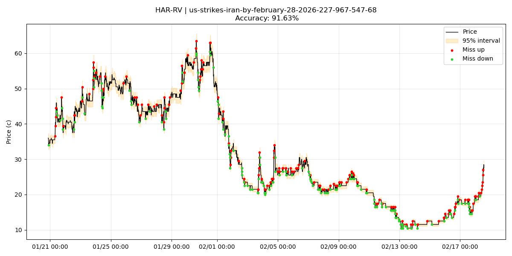

# VolatilityAnalysis
This project uses volatility models (GARCH, REGARCH, HAR-RV, Rogers-Satchell, Ornstein-Uhlenbeck process) to measure observed volatility and forecast price intervals in a sandbox environment: Polymarket's Politics and Sports markets.

## Table of contents
* [How to Run](#how-to-run)
* [Global Analysis of Markets](#global-analysis-of-markets)
* [GARCH Models](#garch-models)
* [HAR-RV Model](#har-rv-model)
* [Key Findings, Limitations, Further Experimentations and Literature](#key-findings-limitations-further-experimentations-and-literature)

## How to Run

#### 1. Requirements 

In your venv, run ```pip install -r requirements.txt```.

#### 2. Running the files

For files in the root folder: ```python3 {name}.py run```.
*Example: ```python3 skewSmile.py run```*


For files in subfolders: ```python3 -m {subfolderName}.{name}```.
*Example: ```python3 -m GARCH.GARCHbacktests```*

## Global Analysis of Markets

#### 1. [utils.py](./utils.py)
In order to pursue volatility analysis, we focus on two types of Polymarket prediction markets: Sports and Politics markets. These are the most common and most popular markets on this platform.
Among these categories, we add selection criteria: 
- **High Volume**: we used high-volume markets (1M+ volume) for this analysis. This setting can be modified by user input for each program.
- **Sufficient price change**: in order to measure volatility, we need price movement. Hence, we filter out markets whose price haven't moved in the last month, week, or day.

With these filters, between 100 and 150 markets remain eligible.

#### 2. [returnsDistribution.py](./returnsDistribution.py)
Before applying volatility models to our dataset, we need to understand its characteristics.

Log-returns on high-volume prediction markets are highly leptokurtic: they have a highly positive Kurtosis. Thus, using a normal distribution for our GARCH analysis wouldn't be accurate. From now on, we'll use the *Generalized Error Distribution* (GED) of the garch library to fit our models, for adaptative sharp peak and larger tails.

#### 3. [skewSmile.py](./skewSmile.py)
The statistical distribution of log-returns already gives an approximation of the skewness of the data. In order to observe its distribution and its eventual smile or skew, we can plot observed volatility according to price using a simple ARCH(1) model. We'll use more complex models later on.

This graph does not necessarily indicate volatility skewness, but rather a logical mechanism. It reveals how low prices have higher relative changes, and high prices have lower relative changes, with a plateau from 30c to 70c.

#### 4. [getData.py](./getData.py)
Downloads .csv price history of eligible markets in data/Politics and data/Sports folders.


## GARCH Models

#### 1. [GARCHbacktest.py](GARCH/GARCHbacktest.py)
This file uses GARCH volatility models to backtest volatility forecasts on individual markets (requires a slug). The model is fitted on training points, and the volatility forecast it produces is then used to define a 95% confidence price interval forecasts for the next aggregated time period. Then, 10m price is used to count hits (price is in the interval) and misses (price is outside of the predicted price range).

Instead of fitting one model to all available data, we take a more adaptative approach. For each step, we fit 6 models: ARCH(1), ARCH(2), GARCH(1,1), GARCH(2,1), TARCH(1,1,1), TARCH(2,2,1), before comparing their BIC and using the model with the lowest one for the forecast. This program outputs model usage to observe which models are most often used on which markets.

BIC stands for *Bayesian Information Criterion*. It is used to evaluate the fit of different models, rewarding both fit (how well the model explains the data) and simplicity. A lower BIC indicates a better model.



#### 2. [GARCHbacktests.py](GARCH/GARCHbacktests.py)
This file has the same basic principle as ```GARCHbacktest.py``` but iterates on multiple high-volume markets. 
To reduce computing power usage, models are reduced to ARCH(1), GARCH(1,1) and TARCH(1,1,1), since these were the ones regularly obtaining the lowest BICs. 



#### 3. [RogersSatchell.py](GARCH/RogersSatchell.py)

GARCH models can use exogenous variables. Volume can for example be used to fit volatility models. However, such historical volume data is not obtainable via Polymarket API. Obtaining historical volume would require constant Websocket connection and data hoarding for weeks. This could become a future project in order to bypass the 10m maximumum fidelity and 30 days limit on price history, as well as the lack of other variables such as volume, spread and order book dynamics.

However, we can still use more information by transforming our aggregated data into candles, which carries more information than simple closing prices.

In this sense, we use **Rogers & Satchell (1991)** formula

$$\sigma^2_{rs}=\frac{1}{n}\hspace{0.5em}\sum^n_{i=1} \left( \log\hspace{0.3em}\left(\hspace{0.3em}\frac{H_i}{C_i}\hspace{0.3em}\right) \hspace{0.3em}\log\hspace{0.3em}\left(\hspace{0.3em}\frac{H_i}{O_i}\hspace{0.3em}\right) + \log\hspace{0.3em}\left(\hspace{0.3em}\frac{L_i}{C_i}\hspace{0.3em}\right) \hspace{0.3em}\log\hspace{0.3em}\left(\hspace{0.3em}\frac{L_i}{O_i}\hspace{0.3em}\right) \right)$$

as an exogenous variable for GARCH(1,1) and TARCH(1,1,1). 

This added factor only adds complexity to our models and does not improve them on these prediction markets. They never obtain the lowest BIC compared to their simpler counterparts.

#### 4. Upcoming

- Ornstein-Uhlenbeck process
- REGARCH


## HAR-RV Model

Since our data has a relatively high granularity (10m), using GARCH models is sub-optimal: these models were designed to perform on daily prices for extended periods of time, not on intraday price movements.

For intraday predictions, we use the HAR-RV model. Its standard version takes into account different time horizons for its forecasts: monthly, weekly, and daily volatility. Its simple autoregressive structure takes into account different time periods and has a large memory with faster computation speed than the slow BIC-comparison method.

#### 1. [ratioTesting.py](HAR-RV/ratioTesting.py)

This file allows to compare different ratios on individual markets (requires market slug). The standard ratio is 1:7:30. User can add testing ratios in the file. 1 unit corresponds to a 10m time period.

This testing process and the rankings this file produces were used to define ratios used for HAR-RV backtests.

#### 2. [HARbacktest.py](HAR-RV/HARbacktest.py)

This file follows the same structure as ```GARCHbacktest.py```but uses HAR-RV instead of GARCH models in order to forecast volatility. HAR-RV ranges are adaptative according to the length of available data.

By default, we chose: 
- a reactive 6:18:36 (1h:3h:6h) for markets with less than a day of price history
- a longer 24:72:144 (4h:12h:24h) for all other markets.



With HAR-RV, the 95% confidence interval is tighter. Since it operates on more granular data (10m compared to sometimes 4h for the GARCH method), this tight interval can maintain an accuracy close the 95% with more misses but also more hits.

#### 3. [HARbacktests.py](HAR-RV/HARbacktests.py)

Same structure as ```HARbacktest.py``` but allows to test multiple markets at once with type and volume filtering.


## Key Findings, Limitations, Further Experimentations and Literature

#### 1. Key Findinds

- Log-returns on Sports and Politics prediction markets exhibit **extremely high kurtosis**, with a sharp peak and fat tails distribution.
- No noticeable skew or smile in volatility distribution across price ranges, except for the mechanical relative effect observed for extremely low and high prices.
- **Model performance** across 133 high-volume markets:
    * GARCH BIC-comparison method obtained a **93.8% average accuracy** (23,332 misses out of 389,435 data points). **Up and down misses are even**: respectively 49.93% and 50.07%. The program couldn't fit the models for 11 markets.
    *  HAR-RV method obtained a **95.81% average accuracy** (20,297 misses out of 50,5162 data points). Similar balance for up and down misses: respectively 50.7% and 49.3%.
- For the GARCH BIC-comparison method, most used model was **ARCH(1)**. This indicates that more complex models such as GARCH and TARCH are not necessarily better for the price behavior of prediction markets.


#### 2. Limitations

- Due to the low granularity of data, it is impossible to use HFT intraday models that would run on minute interval, or less.
- Lack of data. It is impossible to use volume, spread, or order book dynamics as explanatory variables.

#### 3. Further Experimentation

- Linking this project with news-driven analytics: using breaking news to explain sudden volatility peaks on prediction markets.
- Implementing up and down misses as trading signals for a theoretical trading project to backtest on various market types.
- Collecting data ourselves in order to use more signals for advanced models.

#### 4. Literature
**Paul Wilmott** (2006). *Paul Wilmott on Quantitative Finance*, 2nd Edition. Wiley.

[Polymarket API Documentation](https://docs.polymarket.com/api-reference/introduction)