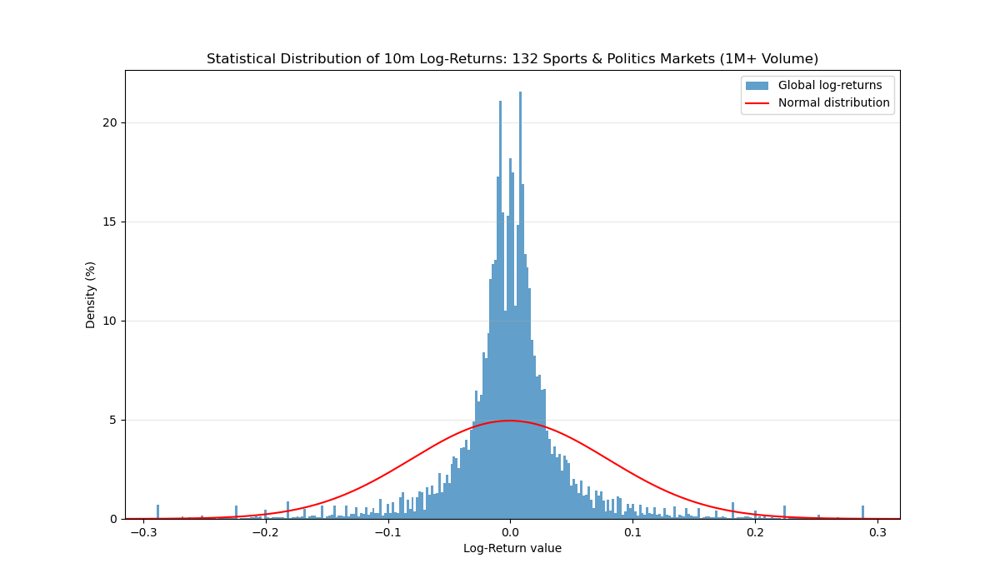
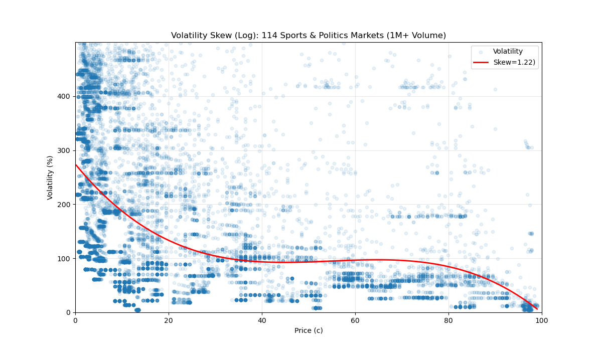
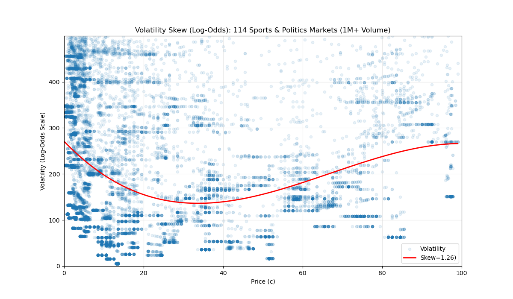
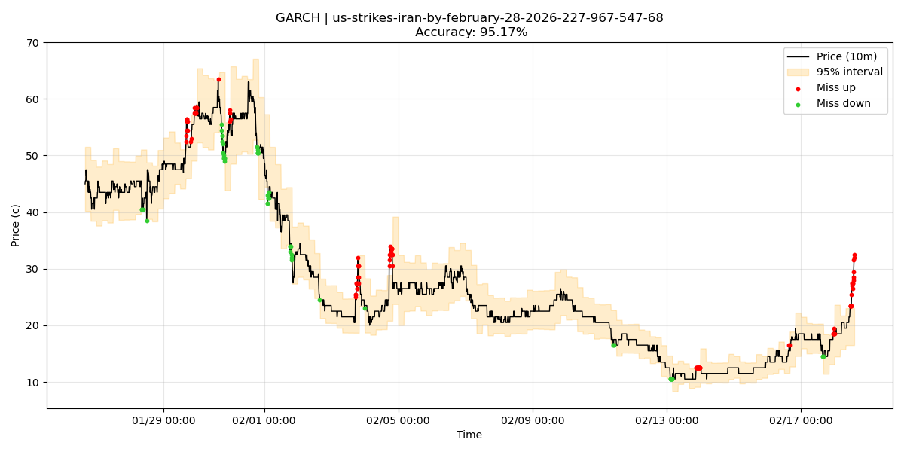
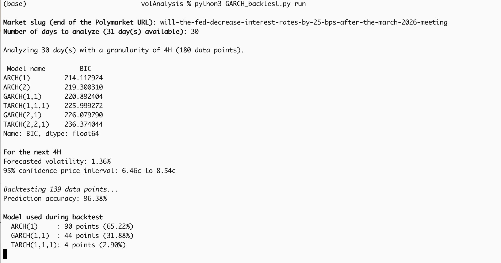
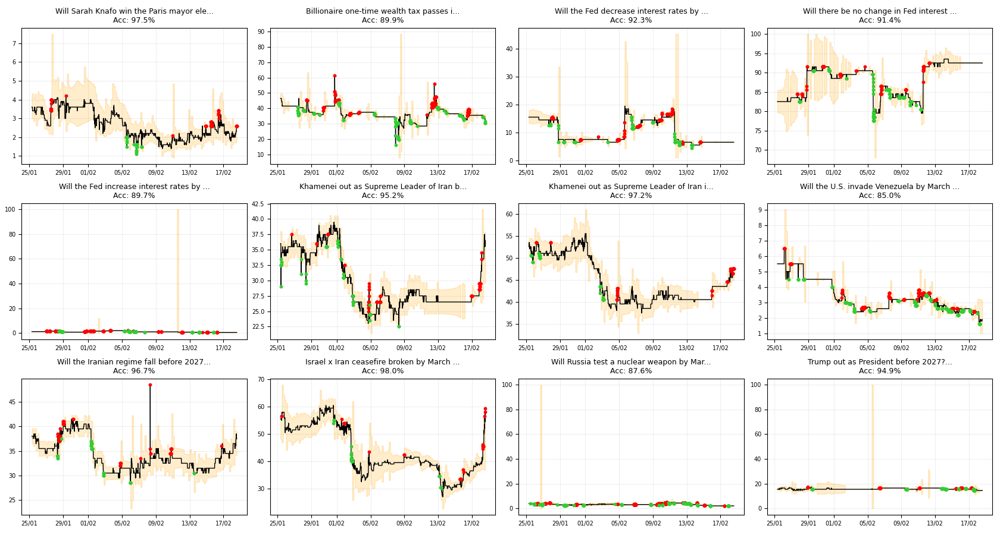
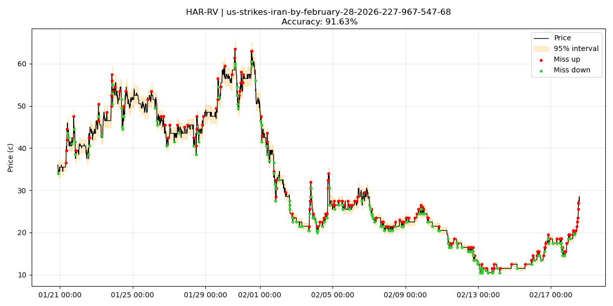
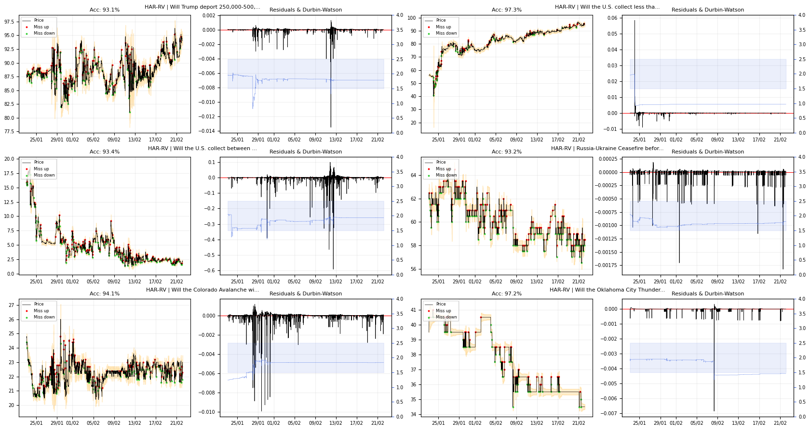

# VolatilityAnalysis
This project uses traditional financial volatility models (GARCH, REGARCH, HAR-RV, Rogers-Satchell, Ornstein-Uhlenbeck process) to measure realized volatility and forecast price intervals in a sandbox environment: Polymarket's Politics and Sports markets.

## Table of contents
* [How to Run](#how-to-run)
* [Global Analysis of Markets](#global-analysis-of-markets)
* [GARCH Models](#garch-models)
* [Ornstein-Uhlenbeck Process](#ornstein-uhlenbeck-process)
* [HAR-RV Model](#har-rv-model)
* [Key Findings, Limitations, Further Experimentations and Literature](#key-findings-limitations-further-experimentations-and-literature)

## How to Run

#### 1. Requirements 

In your venv, run ```pip install -r requirements.txt```.

#### 2. Running the files

To run files located in subfolders: ```python3 -m {subfolderName}.{name}```.
*Example: ```python3 -m GARCH.GARCHbacktests```*

## Global Analysis of Markets

#### 1. [utils.py](./utils.py)
To conduct volatility analysis, we focus on two types of prediction markets: Sports and Politics. These are the most popular and liquid markets on Polymarket.
Among these categories, we select markets meeting precise requirements: 
- **High Volume**: we use high-volume markets (1M+ volume) in order to address functional and competitive market dynamics. *This setting can be modified via user input*.
- **Sufficient price change**: to measure volatility, we need price movement. Hence, we filter out markets whose price haven't moved enough in the last month, week, or day. The goal isn't to focus on large price movements, but to avoid static markets, for example those for which the solution is already public, leading to a fixed price until the last trading day.

With these filters, between 100 and 150 markets remain eligible. Before applying volatility models to our dataset, we need to understand its characteristics.

#### 2. [returnsDistribution.py](./returnsDistribution.py)

Log-returns on high-volume prediction markets are highly leptokurtic: they have a highly positive Kurtosis. 

Thus, using a normal distribution for our GARCH analysis wouldn't be accurate. From now on, we'll use the *Generalized Error Distribution* (GED) of the garch library to fit our models, for adaptative sharp peak and larger tails.

#### 3. [skewSmile.py](./skewSmile.py)
The statistical distribution of log-returns already gives an approximation of the skewness of the data. In order to observe its distribution and its eventual smile or skew, we can plot realized volatility according to price using a simple ARCH(1) model on log returns. We'll use more complex models later on.

This graph does not necessarily indicate volatility skewness, but rather a logical mechanism of log returns. It reveals how a 1c to 2c price change will be accounted as a larger relative price movement than a 90c to 91 price change, with a plateau from 30c to 70c. This mechanism can be countered by using log-odds returns (by converting price changes into relative probabilities, we smooth out extreme moves and make price changes more uniform).

With this fix, volatility is equally as high for extremely high and low prices, with lower volatility from 10c to 70c. There is an positively-skewed volatility smile.

#### 4. [getData.py](./getData.py)
Used to downloads .csv price history of eligible markets in data/Politics and data/Sports folders. The maximum granularity is 10m intervals for 30 days of historical data.


## GARCH Models

#### 1. [GARCHbacktest.py](GARCH/GARCHbacktest.py)
This file uses GARCH models to backtest volatility forecasts on individual markets (requires an individual market slug to run). The model is fitted on an initial amount of training points. The volatility forecast it outputs is then used to define a 95% confidence price interval forecast for the next aggregated time period. Then, 10m observed prices are used to measure hits (price is inside the interval) and misses (price is outside of interval).

Instead of fitting only one model at each step, we take a more adaptative approach. For each aggregated period, we fit 6 differents models: ARCH(1), ARCH(2), GARCH(1,1), GARCH(2,1), TARCH(1,1,1), TARCH(2,2,1). We then compare their BICs and use the model with the lowest one for the forecast.

*BIC stands for Bayesian Information Criterion. It is used to evaluate the fit of different models, rewarding both fit (how well the model explains the data) and simplicity. A lower BIC indicates a better model.*



This program outputs model usage to observe which models are most often used on which markets.

```
Market slug (end of the Polymarket URL): will-the-fed-decrease-interest-rates-by-25-bps-after-the-march-2026-meeting
Number of days to analyze (31 day(s) available): 30
Analyzing 30 day(s) with a granularity of 4H (180 data points).

    Model name         BIC
ARCH (1)            214.112924
ARCH(2)             219. 300310
GARCH (1,1)         220. 892404
TARCH (1,1,1)       225.999272
GARCH(2,1)          226.079790
TARCH(2, 2,1)       236. 374044
Name: BIC, dtype: float64

 For the next 4H
Forecasted volatility: 1.36%
95% confidence price interval: 6.46c to 8.54c

Backtesting 139 data points...
Prediction accuracy: 96.38%

Model used during backtest
 ARCH(1)     : 90 points (65.22%)
 GARCH(1,1)  : 44 points (31.88%)
 TARCH(1,1,1): 4 points (2.90%)
```




#### 2. [GARCHbacktests.py](GARCH/GARCHbacktests.py)
This file has the same basic principle as ```GARCHbacktest.py``` but iterates on multiple high-volume markets. 
To reduce computing power, the list of models is reduced to ARCH(1), GARCH(1,1) and TARCH(1,1,1). These were the models regularly obtaining the lowest BICs on individual markets.



#### 3. [RogersSatchell.py](GARCH/RogersSatchell.py)

GARCH models can use exogenous variables in their forecasts. For volatility models, volume can be used. However, historical volume is not obtainable via Polymarket API. Obtaining it would require a constant Websocket connection hoarding data for a list of markets for weeks. *This could become a future project in order to bypass the 10m maximumum fidelity and 30 days limit on price history, as well as the lack of other variables such as volume, spread and order book dynamics.*

Still, we can use additionnal information by transforming our aggregated price data into price candles, since they carry more information than simple closing prices.

In this sense, we use **Rogers & Satchell (1991)** formula as an exogenous variable for GARCH(1,1) and TARCH(1,1,1) models:

$$\sigma^2_{rs}=\frac{1}{n}\hspace{0.5em}\sum^n_{i=1} \left( \log\hspace{0.3em}\left(\hspace{0.3em}\frac{H_i}{C_i}\hspace{0.3em}\right) \hspace{0.3em}\log\hspace{0.3em}\left(\hspace{0.3em}\frac{H_i}{O_i}\hspace{0.3em}\right) + \log\hspace{0.3em}\left(\hspace{0.3em}\frac{L_i}{C_i}\hspace{0.3em}\right) \hspace{0.3em}\log\hspace{0.3em}\left(\hspace{0.3em}\frac{L_i}{O_i}\hspace{0.3em}\right)\right)$$

*With $O_i$ as opening price, $C_i$ as closing price, $H_i$ as highest price and $L_i$ as lowest price.*


After running the RS version of our models, we observe that this new factor purely adds complexity and does not improve our models on these prediction markets. RS variations of basic models never obtain the lowest BIC compared to their simpler counterparts.

```
        4H forecast
 Model name         BIC
GARCH(1,1)         411.544081
GARCH(1,1) RS      411.544081
TARCH(1,1,1)       415.135977
TARCH(1,1,1) RS    415.135977
ARCH(1)            425.985899
```


## Ornstein-Uhlenbeck Process

While GARCH models focus on conditional variance, we use the Ornstein-Uhlenbeck Process (OU) to treat the realized volatility as a mean-reverting process, for which the mean-reverting force increases the further volatility moves away from its average. This is based on the assumption that volatility tends to cluster and then decay to its long-term average after an information shock.

#### 1. [ornsteinUhlenbeck.py](./ornsteinUhlenbeck.py)

This model assumes that volatility follows a stochastic differential equation:
$$d\sigma_t = \kappa (\mu - \sigma_t) dt + \sigma_{ou} dW_t$$

In this model, $\kappa$ represents the mean reversion speed. $\mu$ is the long-term mean volatility equilibrium of the market. $\sigma_ou$ is the volatility of the volatility: is inherent noise of the volatility process itself.

We estimate these parameters by fitting an AR(1) process on rolling realized volatility. The rolling window was arbitrarly chosen. This OU model can be run on multiple markets, and obtains sufficiently high accuracy.

```
Will_Phan_Văn_Giang_be_the_next_President_of_Vietnam?_0.4.csv...
Accuracy:       94.46%
Hits:           3120 (94.46%)
Miss up:        108 (3.27%)
Miss down:      75 (2.27%)
Mean Reversion: 0.0426
Long-term Vol:  0.0709
Vol of Vol:     0.0095
```


## HAR-RV Model

Since our data has a relatively high granularity (10m), using GARCH models is sub-optimal: these models were designed to perform on daily prices for extended periods of time, not on intraday price movements.

To solve this issue, we use the HAR-RV model. Its traditional financial version takes into account different time horizons for short-term volatility forecasts: daily, weekly and monthly volatility (1:5:22 ratio). Its simple autoregressive structure takes has a large memory with faster computation speed than the slow GARCH BIC-comparison method.

#### 1. [ratioTesting.py](HAR-RV/ratioTesting.py)

This testing file compares different ratios on individual markets (requires individual market slug). The standard ratio of the HAR-RV model is 1:5:22. For constantly running markets, this ratio becomes 1:7:30. User can add testing ratios in the file. *Note: 1 unit corresponds to a 10m time period.*

Rankings produced by this file were used to define ratios used for HAR-RV backtests.

#### 2. [HARbacktest.py](HAR-RV/HARbacktest.py)

This file follows the same structure as ```GARCHbacktest.py```but uses HAR-RV instead of GARCH models to forecast volatility. HAR-RV ranges are adaptative according to the length of historical available data.

By default, we chose the following ratios: 
- a reactive 6:18:36 ratio (1h:3h:6h) for markets with less than a day of price history
- a longer 24:72:144 ratio (4h:12h:24h) for all other markets.



With HAR-RV, the 95% confidence interval we obtain is tighter. Since it operates on more granular data (10m frequency compared to 4h frequency for most GARCH examples), this tight interval can maintain an accuracy close the 95% with more misses that are balanced with more frequent hits.

#### 3. [HARbacktests.py](HAR-RV/HARbacktests.py)

This file shares the same structure as ```HARbacktest.py```. It tests multiple markets with market type and volume filtering. It provides residuals measurement and Durbin-Watson calculation for each market in order to account for autocorrelation of residuals.



## Key Findings, Limitations, Further Experimentations and Literature

#### 1. Key Findinds

- Log-returns on Sports and Politics prediction markets exhibit **extremely high kurtosis**, with a sharp peak and fat tails distribution.
- A positively-skewed smile is present in log-odds volatility distribution across price ranges.
- **Model performance** across high-volume markets:
    * *GARCH BIC-comparison method* obtained a **93.8% average accuracy** (23,332 misses out of 389,435 data points across 122 markets). **Up and down misses are even**: respectively 49.93% and 50.07%. The program couldn't fit the models for 11 markets out of 133. The most used model was **ARCH(1)**. This indicates that more complex models such as GARCH and TARCH are not necessarily better for the price behavior of prediction markets.
    *  *HAR-RV method* obtained a **95.81% average accuracy** (20,297 misses out of 50,5162 data points for 133 markets). Similar balance for up and down misses: respectively 50.7% and 49.3%.
    * *Ornstein-Uhlenbeck process* obtained a 93.23% accuracy over 115 markets.


#### 2. Limitations

- Due to the low granularity of data, it is impossible to use HFT intraday models that would run on minute interval, or less.
- Lack of data. It is impossible to use volume, spread, or order book dynamics as explanatory variables.

#### 3. Further Experimentation

- Linking this project with news-driven analytics: using breaking news to explain sudden volatility peaks on prediction markets.
- Implementing up and down misses as trading signals for a theoretical trading project to backtest on various market types.
- Collecting data ourselves in order to use more signals for advanced models.

#### 4. Literature
**Paul Wilmott** (2006). *Paul Wilmott on Quantitative Finance*, 2nd Edition. Wiley.

**Fulvio Corsi** (2009). [A Simple Approximate Long-Memory Model of Realized Volatility](https://statmath.wu.ac.at/~hauser/LVs/FinEtricsQF/References/Corsi2009JFinEtrics_LMmodelRealizedVola.pdf).


[Polymarket API Documentation](https://docs.polymarket.com/api-reference/introduction)
